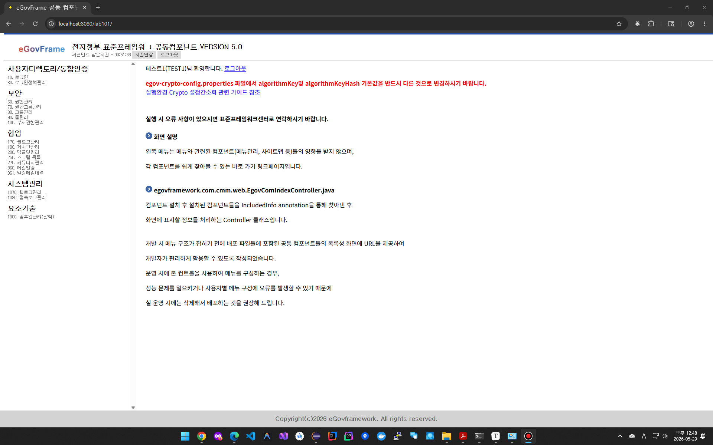

# 01. 개발환경 과제

> ...

## (1) LAB 1-1: [공통컴포넌트 생성 및 조립 도구 실습(eclipse)](lab-1-1)

* 웹브라우저 로그인 후 화면

  

## (2) LAB 1-2: [템플릿 프로젝트 생성 실습(Eclipse)](lab-1-2)

* 웹브라우저 화면

## (3) LAB 1-3: [템플릿 프로젝트 생성 실습 (VS Code)](lab-1-3)

* 웹브라우저 화면

  

## (4) LAB 1-4: [Code Generation 실습 (VS Code)](lab-1-4)

* 웹브라우저 화면
