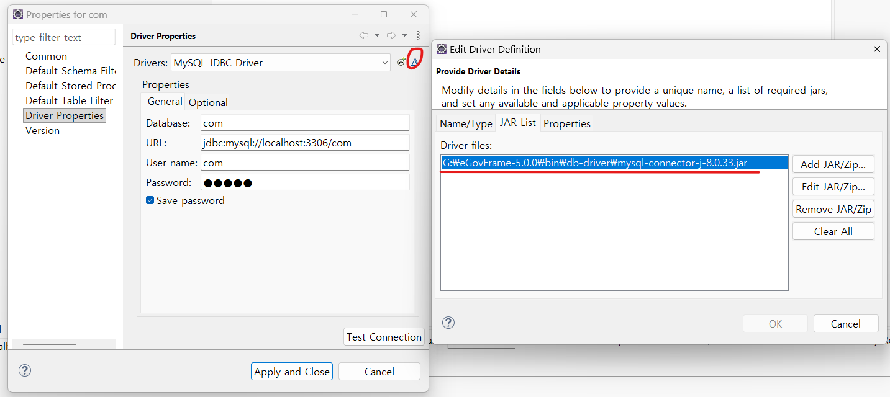

# (1) LAB 1-1: 공통컴포넌트 생성 및 조립 도구 실습(Eclipse)

> ...

## 진행

템플릿으로 프로젝트 생성해서 Eclipse에서 Tomcat으로 돌려보는 실습이다.

## 이슈 사항

내 환경이, egovframework를 `G:\`드라이브에 설치해서, Data Source Explorer에 등록되어있는 com 연결에 대한 MySQL 드라이버 경로를 `G:\` 기준으로 바꿔줘야한다.

