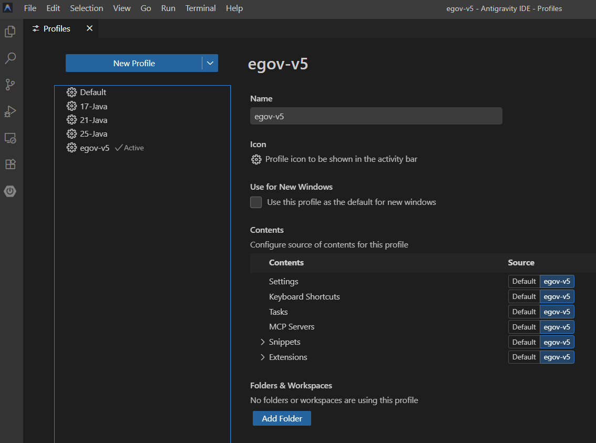
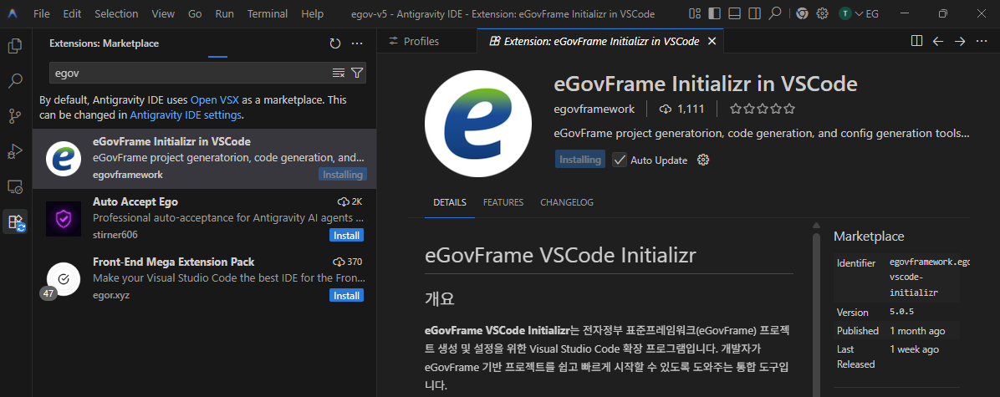
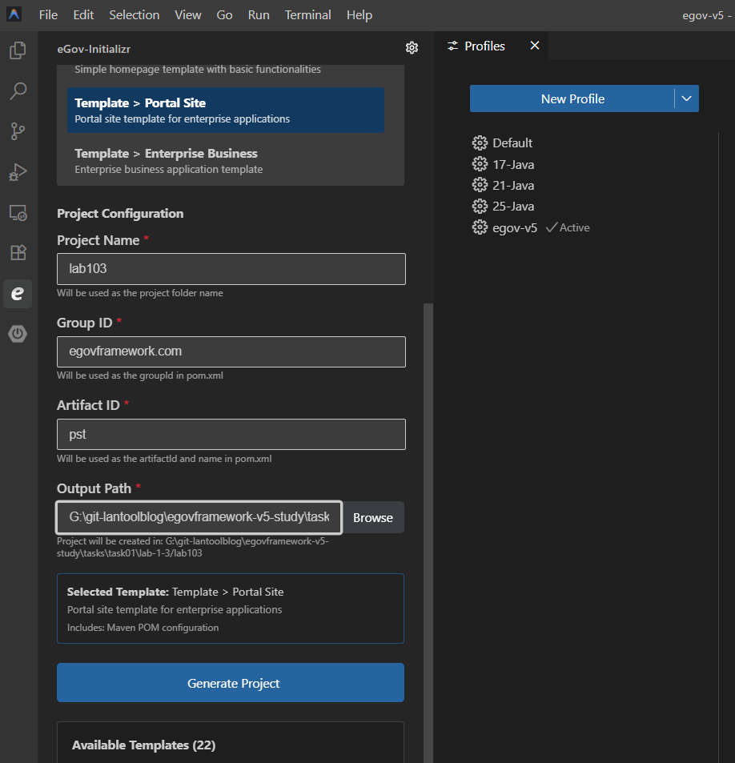

# (3) LAB 1-3: 템플릿 프로젝트 생성 실습 (VS Code)


내가 사용중인.. VSCode가 복잡한 상태라 Antigravity에다 설치해서 쓰기로 했음..

**egov-v5**라는 프로필을 만듬.



사용중인 Java 환경 프로필을 상속받아 새로운 프로필을 만드는 것이 나을 것 같다.

나는 `eGovFrame Initializr in VSCode `를 설치하면 Java 환경까지 자동으로 설정하는 줄 알았는데 그건 아니였다.

* `17-Java` 프로필 쓰던거 상속받아서 쓰면 편할뻔했음...😂


eGovFrame Initializr in VSCode 확장 설치

* https://open-vsx.org/vscode/item?itemName=egovframework.egovframe-vscode-initializr



역시 용량이 큰지? 설치 시간 꽤걸림..


과제에서 만들라는데로 만듬...




* 프로퍼티 파일용 확장은 아래 것을 vsix로 받아 antigravity에 설치해주자!
  * https://github.com/kuju63/properties-editor


### Maven 설정 수정 필요

```json
    // Maven
    "maven.executable.path": "G:\\eGovFrame-5.0.0\\bin\\apache-maven-3.9.9\\bin\\mvn",
    "maven.settingsFile": "G:\\eGovFrame-5.0.0\\maven\\settings.xml",
    "maven.executable.preferMavenWrapper": true,
    "maven.terminal.useJavaHome": true,
    "maven.terminal.customEnv": [
        {
            "environmentVariable": "MAVEN_HOME",
            "value": "G:\\eGovFrame-5.0.0\bin\\apache-maven-3.9.9"
        },
        {
            "environmentVariable": "JAVA_HOME",
            "value": "C:\\JDK\\17"
        },
        {
            "environmentVariable": "Path",
            "value": "C:\\JDK\\17\\bin;G:\\eGovFrame-5.0.0\bin\\apache-maven-3.9.9\\bin;C:\\Gradle\\9.x\\bin;${env:PATH}"
        }
    ],
```

전자정부 프레임워크 5.0 교육자료에 포함된 Maven 로컬 리포지 토리를 사용하도록 수정이 필요함.


그리고 Redhat의 Community 서버 설정하는 법은...

내가 가이드를 따로 적었으니 그거 참조하면 되겠다.

* VSCode 및 Antigravity IDE에서 Tomcat 연동하기: Redhat Community Server Connectors 사용 가이드
  * https://github.com/lantoolblog/redhat-community-server-connectors-guide