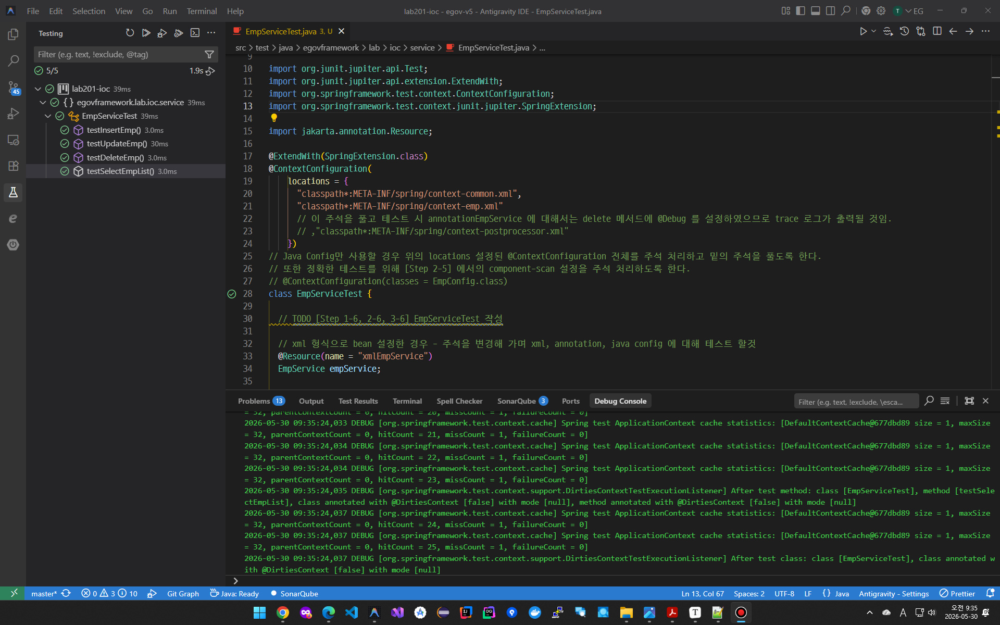
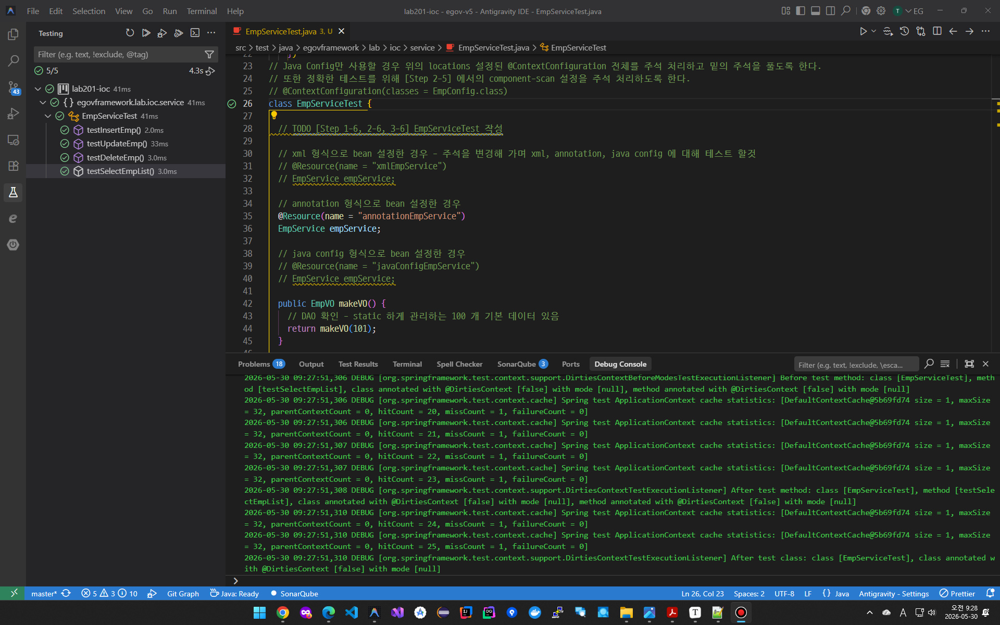
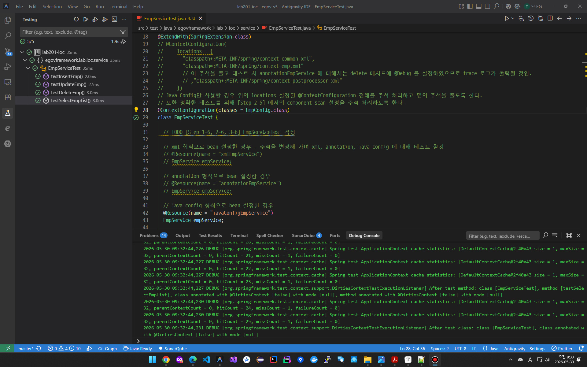
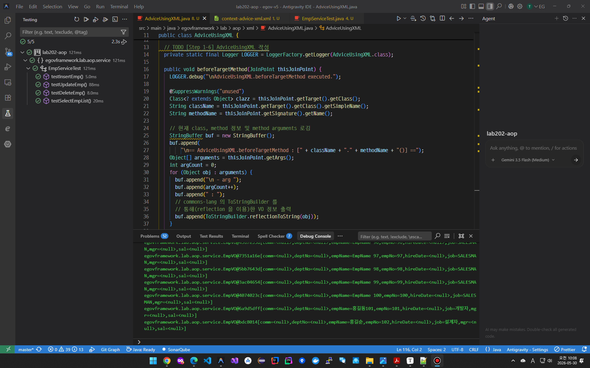

# 02. 실행환경 공통기반 과제

> ...

## (1) LAB201-ioc (1): [IOC 실습(1)](lab201-ioc)

* XML을 이용한 IOC 설정

* TaseCase 작성 후 JUnit 실행 결과 화면

  

## (2) LAB201-ioc (2): [IOC 실습(2)](lab201-ioc)

* Annotation을 이용한 IOC 설정

* TaseCase 작성 후 JUnit 실행 결과 화면

  

## (3) LAB201-ioc (3): [IOC 실습(3)](lab201-ioc)

* Java Config 설정 방식을 이용한 IOC 설정

* TaseCase 작성 후 JUnit 실행 결과 화면

  
  
  

## (4) LAB202-aop: [AOP 실습](lab202-aop)

* XML 설정방식의 AOP 테스트
* TaseCase 작성 후 JUnit 실행 결과 화면
  

