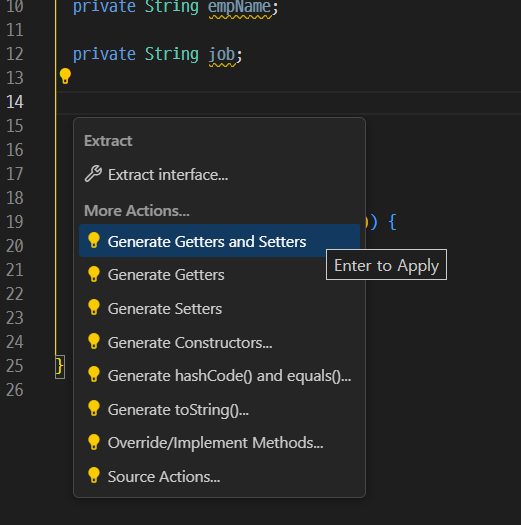
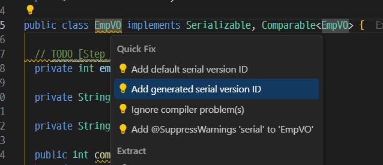

# ...

>  Antigravity에서 실습해보자


## getter/setter 추가

코드의 적절한 위치에서 `Ctrl + .` 할수 있는 작업이 나오는데.. 

`Generate Getters and Setters`를 선택해서 엔터를 눌러주면 코드가 생성된다.



## SerialVersionUID 추가

해당 필드가 없어도 경고로 처리되지 않는 것이 기본 값이여서, `Ctrl + .` 목록에 뜨지 않는다.

일단 경고로 바꿀 필요가 있는데... 

`프로젝트_루트\.settings\org.eclipse.jdt.core.prefs` 파일을 열어서 아래 내용을 추가해준다.

```
org.eclipse.jdt.core.compiler.problem.missingSerialVersion=warning
```

그 뒤에 아래처럼 노란색 줄 표시 부분에서, `Ctrl + .`을 눌러주면 `Add generated serial version ID` 메뉴가 나타난다.



