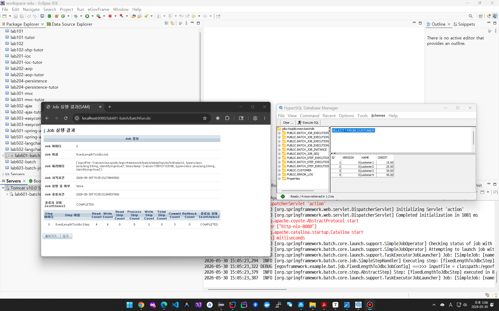
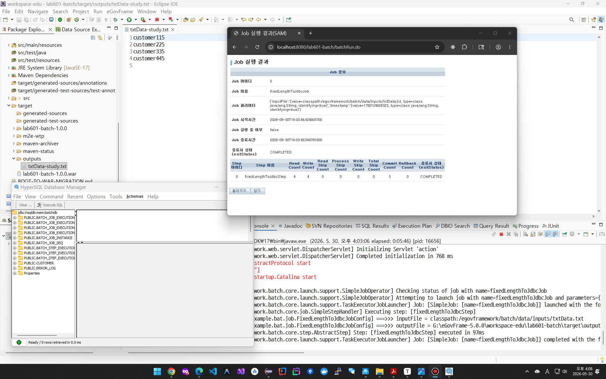
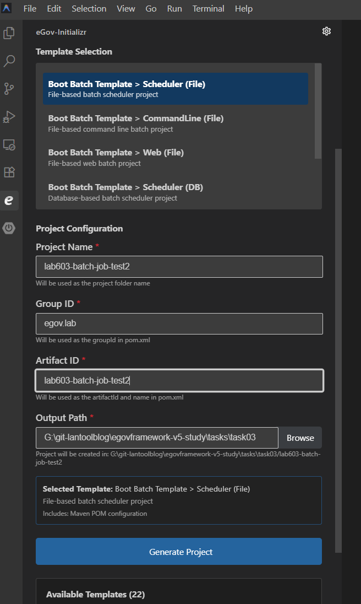
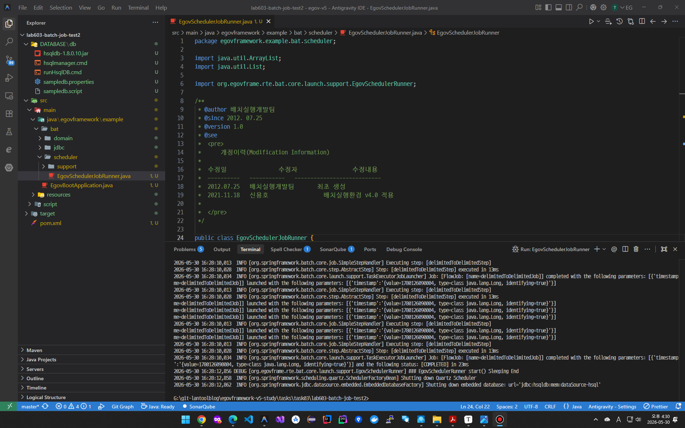
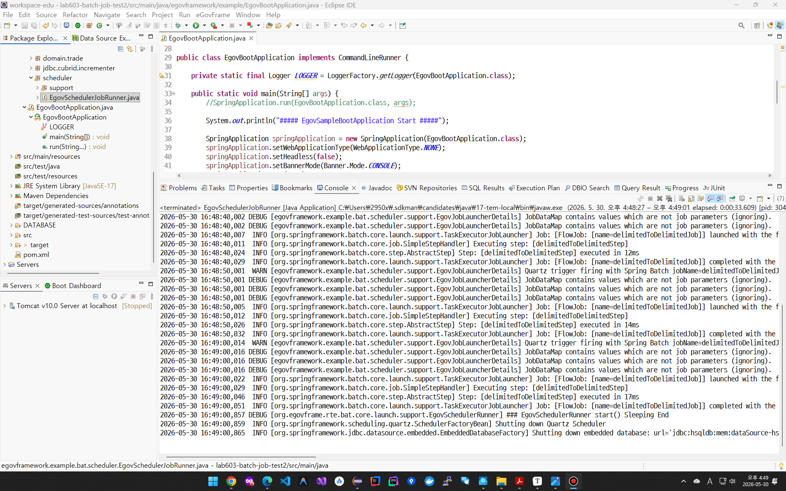
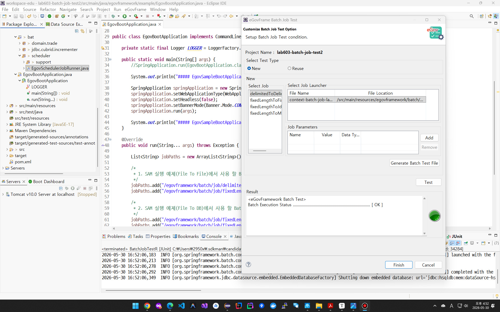

# 03. 실행환경 배치 처리 과제

> ...


## (1) LAB 1. [Web 기반 배치 어플리케이션 구동 및 배치 실행](lab601-batch)

* fixedLengthToJdbcJob을 구동한 결과 화면

  


## (2) LAB 2. [File to DB → File to File 변경](lab601-batch)

* File to DB → File to File 변경 하여 실습을 완료한 결과 화면

  
  
  * txtData-study.txt가 target/outputs에 정확하게 위치하기 위해서는...
  
    * Eclipse에서 실행필요
  
    * 프로젝트가 Eclipse Workspace 디렉토리 안에 있어야한다.
  
      * 테스트 코드 자체를, 왠지 실행 유저 홈에 `~/egov-tutorial-batch-result` 이런 디렉토리를 만들고 거기에다가 결과 파일을 넣는식으로 수정되는게 다른 IDE에서도 쓰기 쉬울 것 같다.
  
        ```java
        // 1. OS를 가리지 않는 로그인한 실행 유저의 순수 홈 디렉토리 경로 확보
        String userHome = System.getProperty("user.home");
        
        // 2. 홈 디렉토리에하에 배치 결과물 폴더 경로 생성
        String outputDir = userHome + File.separator + "egov-tutorial-batch-result";
        
        // 3. 폴더가 없으면 디렉토리 생성
        File targetFolder = new File(outputDir);
        if (!targetFolder.exists()) {
            targetFolder.mkdirs();
        }
        
        // 4. 최종 결과 파일 경로 맵핑
        String finalOutputPath = outputDir + File.separator + "txtData-study.txt";
        
        System.out.println("배치 파일 결과 경로: " + finalOutputPath);
        ```
  
        


## (3) LAB 3. [배치 템플릿 프로젝트 생성 및 테스트 실습](lab603-batch-job-test2)

* Batch Job을 테스트 한 결과 화면을 캡쳐

* Antigravity에서 해보자! 동일한 생성 메뉴가 있는 것 같다.

  
  
  * 이게 DATABASE 디렉토리도 만들어주는데, 어차피 배치 프로젝트에서 인메모리 HSQLDB를 써서 사용하지 않고 있고... 버전도 오래된 버전이다.. 지우자..!!
  
  * EgovSchedulerJobRunner 실행 화면
    
  
    
  
  전자정부 프레임워크 VSCode 확장에 배치 테스트 코드 추가 기능은 없어서... 테스트 코드 추가 기능은 전자정부프레임워크IDE로 열어서 해야겠다.
  
  
  
  전자정부 프레임워크 IDE에서 EgovSchedulerJobRunner를 Java Application으로 실행해보자!
  
  
  
  
  
  역시 전자정부프레임워크 IDE에서는 배치 프로젝트 인식이 잘되고, Test를 자동으로 추가할 수 있었다.
  
  
  
  

