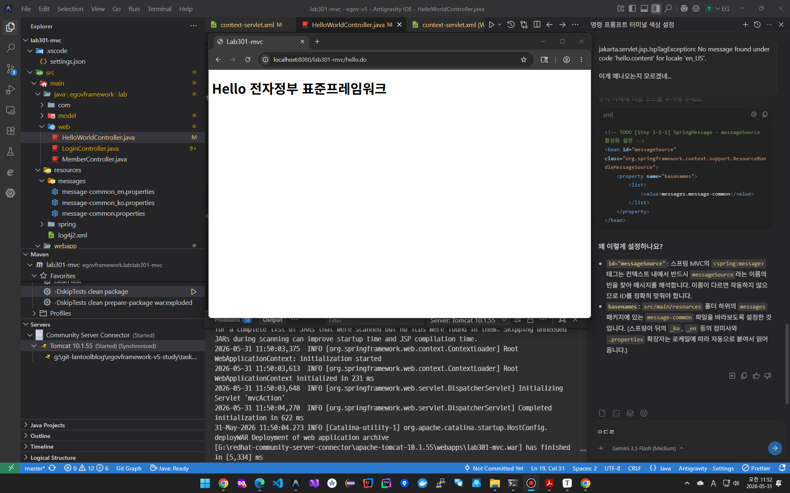
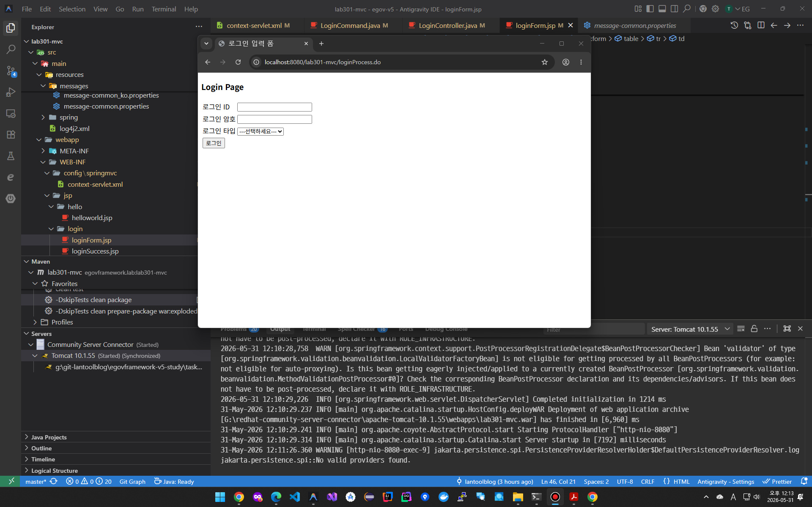
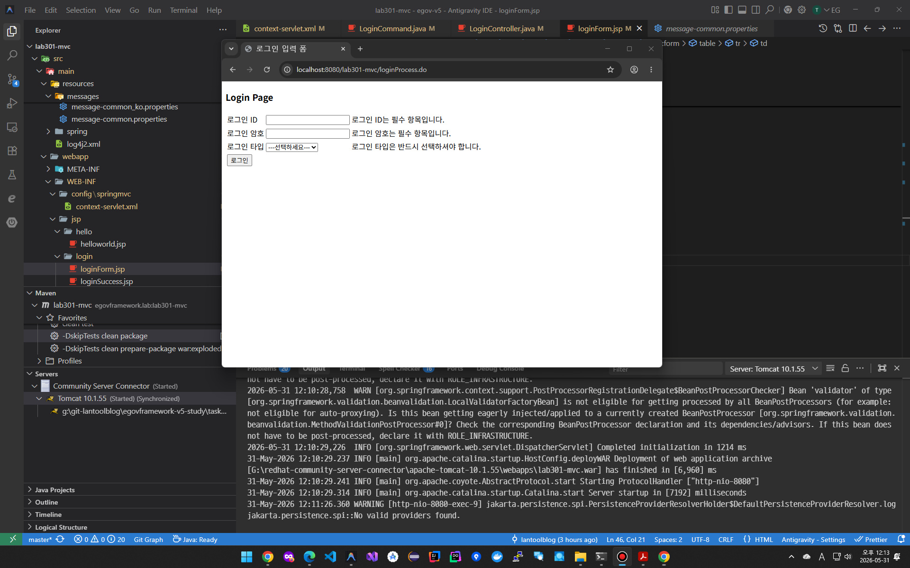

# 05. 실행환경 화면 처리 과제

> ...

## (1) LAB 301: [MVC 실습](lab301-mvc)

##### 과제(1) - MVC 실습 - MVC 첫화면

##### 과제(2) - MVC 실습 - Hello World 페이지

##### 과제(3) - MVC 실습 - 로그인 페이지

##### 과제(4) - MVC 실습 - 로그인 페이지의 유효성 검증 결과

##### 과제(5) - MVC 실습 - 로그인 성공 페이지

##### 과제(6) - MVC 실습 - 로그인 후 사용자 정보 보기 페이지

##### 과제(7) - MVC 실습 - 로그인 페이지 다국어 처리 결과

## (2) LAB 302: [Ajax 실습](lab302-ajax)

##### 과제(8) - Ajax 실습 - Ajax 첫 화면

##### 과제(9) - Ajax 실습 - autoComplete 기능 구현

##### 과제(10) - Ajax 실습 - autoComplete, autoSelect 기능 구현

