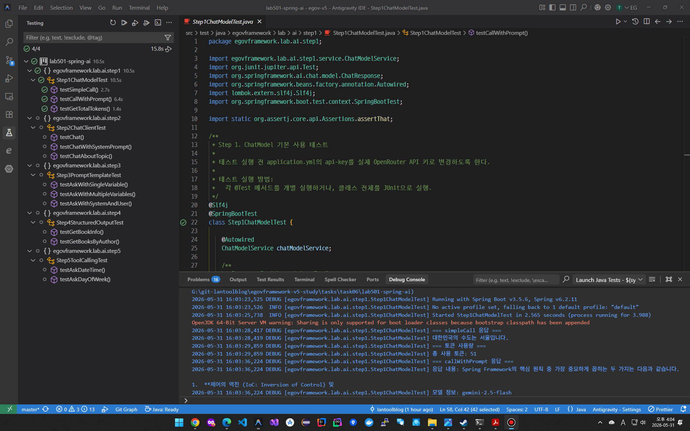
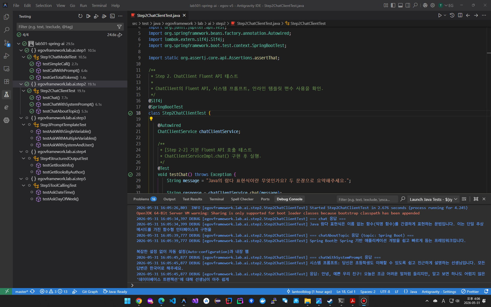
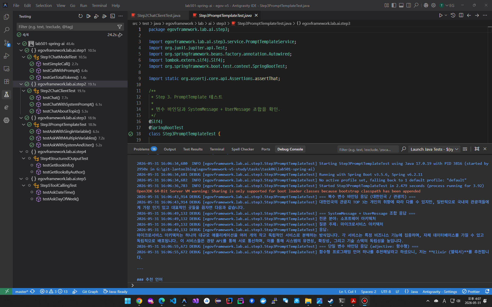
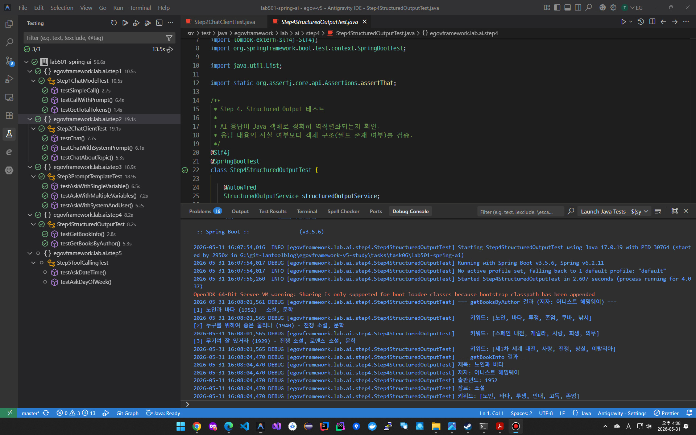
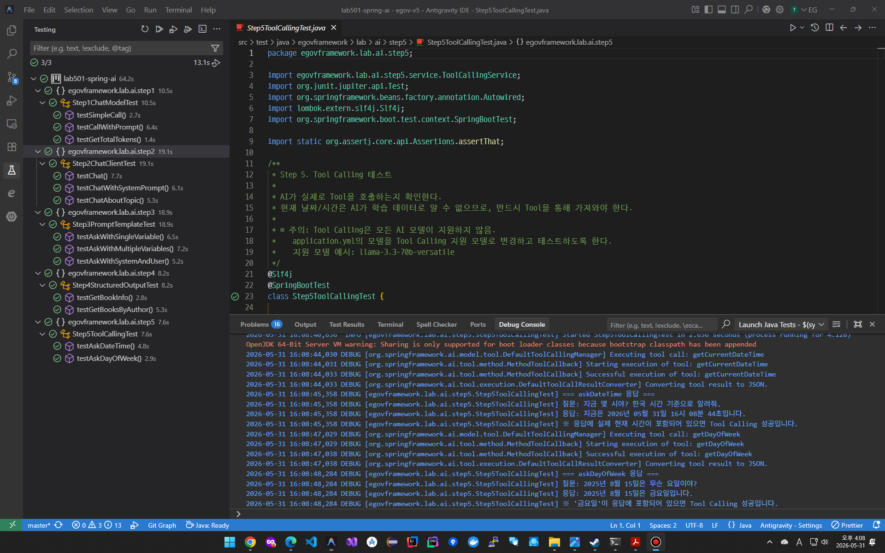

# 06. Spring AI 과제

> GEMINI API 키 사용했는데, 특별한 문제 없이 잘 동작하였다.
>
> ✨ API키는 시스템 환경변수에다 등록해서 사용했음.
>
> ```yml
> spring:
>   application:
>     name: lab-spring-ai
>   ai:
>     openai:
>       # Gemini API : 시스템 환경변수에 GOOGLE_API_KEY 변수에 API 키를 미리 설정했음. 
>       api-key: ${GOOGLE_API_KEY}
>       base-url: https://generativelanguage.googleapis.com
>       chat:
>         completions-path: v1beta/openai/chat/completions
>         options:
>           # 사용할 모델을 지정.
>           model: gemini-2.5-flash
>           # Step 5 (Tool Calling)
>           # model: llama-3.3-70b-versatile
>           max-tokens: 1024
> ```


## (1) LAB 501: [Spring AI 실습](lab501-spring-ai)

##### Spring AI 실습(1) - ChatModel 기본 사용




##### Spring AI 실습(2) - ChatClient Fluent API




##### Spring AI 실습(3) - PromptTemplate




##### Spring AI 실습(4) - Structed Output




##### Spring AI 실습(5) - Tool Calling




## (2) LAB 502: [Langchain4j 실습](lab502-langchain4j)

##### Langchain4j 실습(1) - ChatModel 기본 사용

##### Langchain4j 실습(2) - AiServices

##### Langchain4j 실습(3) - PromptTemplate

##### Langchain4j 실습(4) - Structed Output

##### Langchain4j 실습(5) - Tool Calling
